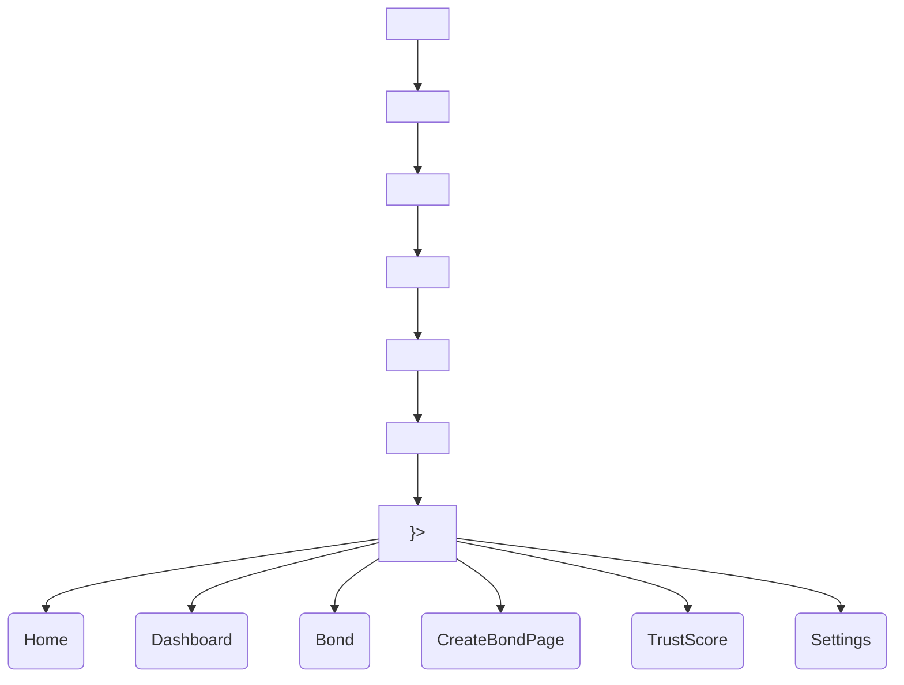

# Architecture Overview

This document describes the runtime structure, intended data flow seams, and theming mechanics for the Credence frontend.

## Provider Tree and Route Architecture

The application's provider tree in `src/App.tsx` establishes the foundation for global state and routing. **The order of these providers is load-bearing.**

### Context Responsibilities

1. **`SettingsProvider`**: Manages global user preferences (theme mode, network, address display) and application settings (toast toggles and auto-dismiss timing). It must sit high in the tree because it reads from `localStorage` and applies the data-theme immediately.
2. **`WalletProvider`**: Manages Stellar wallet connection state, exposed address, and connect/disconnect functionality. Depends on `SettingsProvider` for network preferences.
3. **`ToastProvider`**: Exposes `addToast` and `removeToast` functions for global notifications. **Must be placed inside `SettingsProvider`**, because the toast component reads `toastsEnabled` and `autoDismiss` preferences via `useSettings()` to calculate timeout bounds and global mute states.

### The Route Table & Layout Shell

The route table is defined inside `<Routes>` in `App.tsx` wrapped in `<Suspense>`. It leverages React Router's nested routes.

The top-level route uses `src/components/Layout.tsx` as an application shell. The `Layout` component provides:

- **Skip-link**: A hidden accessibility link for keyboard navigation bypassing the header.
- **Header/Nav**: Contains `MobileNav` (hamburger menu), `ThemeToggle`, and desktop navigation links.
- **Main Content**: Renders child routes inside `<main id="main-content">` via `<Outlet />`.
- **Footer**: Displays standard legal and document links.

## Theming Flow

The application implements a pure CSS-variable theming system triggered via DOM attributes.

1. `ThemeMode` ('light', 'dark', or 'system') is maintained in `SettingsContext`.
2. A `useEffect` inside `SettingsProvider` listens to this state.
3. If 'system' is selected, it uses `window.matchMedia('(prefers-color-scheme: dark)')` to determine the OS preference.
4. It sets the `data-theme` attribute directly on the root `<html>` element.
5. `src/index.css` scopes token overrides (e.g., color variables) based on `[data-theme="dark"]`, seamlessly transitioning the entire app UI.

## Data Flow and API Seams

Currently, the application operates on **mock data** to illustrate UI flows.

- **Bond Page (`src/pages/Bond.tsx`)**: Contains a hardcoded `initialBonds` array mapped to UI models. State transitions (e.g., slash calculations, withdrawal warnings) execute purely in-memory.
- **Trust Score Page (`src/pages/TrustScore.tsx`)**: Retrieves its score and tier information via a mock-enabled `useTrustScore` hook.

### Future API Client Implementation

As referenced in the README, `src/api/` is the designated boundary for typed API clients and real data fetching.

When replacing mock data with real integration:

1. Create data fetching functions inside `src/api/` using the standard `apiFetch<T>()` helper. This ensures all HTTP calls get consistent proxy prefixing, error typing (`ApiError`), and abort signal handling.
2. Consume these functions via custom data hooks (e.g., `useQuery` or dedicated React hooks).
3. Connect `Bond` and `TrustScore` components to the new hooks instead of internal state, delegating all Stellar contract reads/writes and backend endpoints to the `api` layer.
